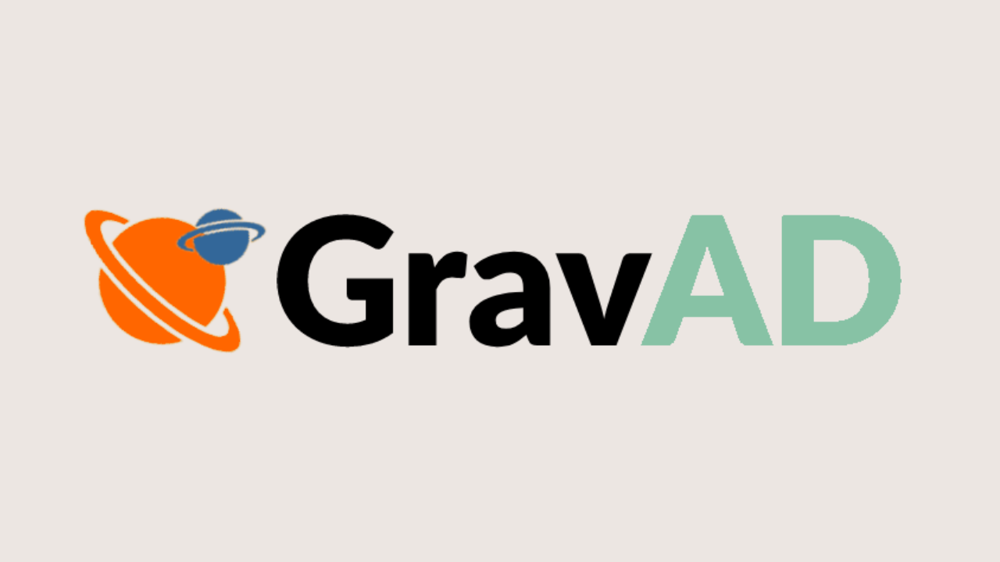
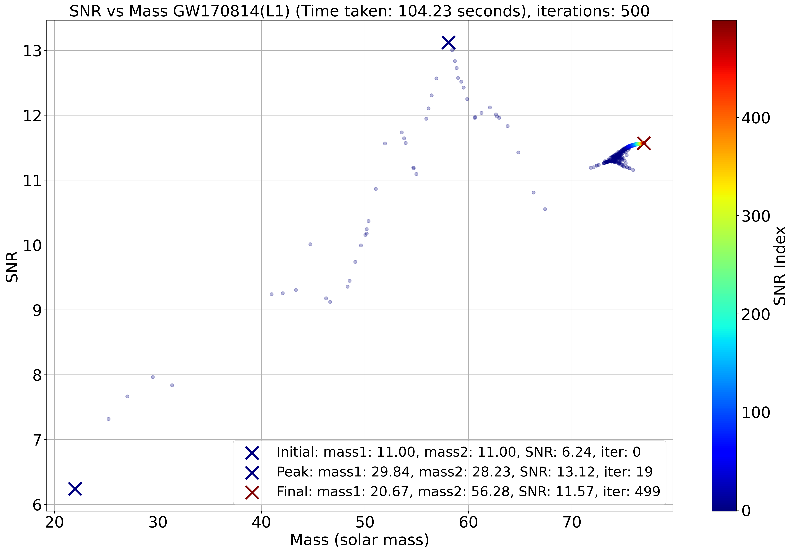
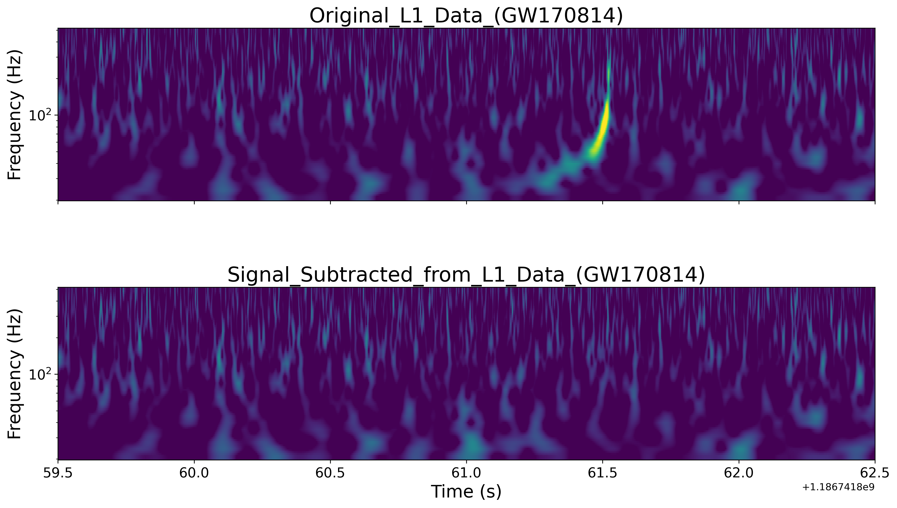

<p align="center">
  
</p>

<h1 align="center">GravAD</h1>
<p align="center">
  <b>Gravitational Wave Analysis using Auto Differentiation with JAX</b>
</p>

<p align="center">
  <a href="https://github.com/WDoyle123/GravAD/issues">Report Bug</a>
  ·
  <a href="https://github.com/WDoyle123/GravAD/issues">Request Feature</a>
</p>

  [](https://forthebadge.com)

---

## Table of Contents

- [Info](#info)
- [Features](#features)
- [Installation](#installation)
- [Usage](#usage)
- [Screenshots](#screenshots)
- [Authors](#authors)
- [Acknowledgements](#acknowledgements)
- [License](#license)

---

## Info

GravAD offers a cutting-edge approach to gravitational wave detection, leveraging Automatic Differentiation (AD), [JAX](https://github.com/google/jax), and [Ripple](https://github.com/tedwards2412/ripple) for template generation via IMRPhenomD. GravAD quickly pinpoints potential gravitational wave events in detector data by optimising the matched filtering process. Despite using fewer templates and significantly reducing computational time, it achieves nearly equivalent results to the established LIGO pipelines. This efficiency positions GravAD as an ideal preliminary tool in gravitational wave research, quickly sifting through data to highlight promising candidates for detailed analysis. GravAD also serves as an additional validator to existing search pipelines, fortifying their credibility.

## Features

- Dynamic Template Generation
- Optimised for GPUs
- Graphs and Results
- Works using real LIGO data

## Installation

### Prerequisites

This software requires Python 3.11.3 or newer, and has dependencies that can be installed via pip or conda. You can view the full list of dependencies in the `requirements.txt` file.

### Installation via GitHub

1. Clone the GravAD repository to your local machine:
```
git clone https://github.com/WDoyle123/GravAD.git
```
2. Navigate to the cloned repository:
```
cd GravAD
```
3, Install the required packages:
```
pip install -r requirements.txt
```

## Usage

Once you have installed all the prerequisites and set up GravAD, you can start using it for gravitational wave analysis. 

Here is a simple example of how you might use GravAD:

### Changing the constants

You can alter the detection frequencies, number of iteration GravAD runs for (how many templates), aswell as adjusting the simulated annealing optimisation.

```
# Constants
SAMPLING_RATE = 2048
LOW_FREQ_CUTOFF = 20.
HIGH_FREQ_CUTOFF = 1000.
MAX_ITERS = 500
TEMPERATURE = 1
ANNEALING_RATE = 0.99
LRU = 1.5 # Learning Rate Upper
LRL = 5.5 # Learning Rate Lower
SEED = 1
```

### Changing Events and Strains

In the ```main()``` function you can alter which signals you want to detect and from which detector.

```
events = [
"GW150914", "GW151012", "GW151226", "GW170104", "GW170608", "GW170729",
"GW170809", "GW170814", "GW170817", "GW170818", "GW170823"]

strains = ["H1", "H2", "L1", "L2"]
```

## Screenshots





Check out [graphs](./graphs) for more!

## Authors

- [@WDoyle123](https://github.com/WDoyle123)
- Supervisor [@andrew-lundgren](https://github.com/andrew-lundgren)

## Acknowledgements

We would like to acknowledge the use of [ripple](https://github.com/tedwards2412/ripple) for template generation in this project.
