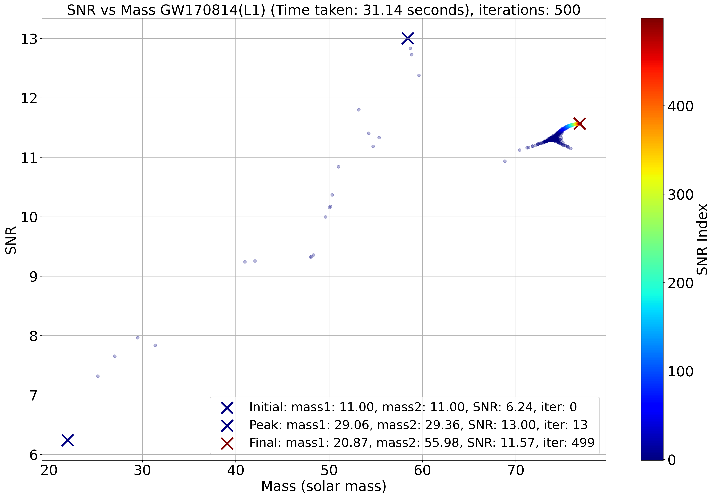

  

<h1 align="center">GravAD</h1>

  <b>Gravitational Wave Analysis using Auto Differentiation with JAX</b>

  <a href="https://github.com/WDoyle123/GravAD/issues">Report Bug</a>
  ·
  <a href="https://github.com/WDoyle123/GravAD/issues">Request Feature</a>

  

---

## Table of Contents

- [Info](#info)
- [Features](#features)
- [Installation](#installation)
- [Usage](#usage)
- [Screenshots](#screenshots)
- [Authors](#authors)
- [Acknowledgements](#acknowledgements)
- [License](#license)

---

## Info

GravAD offers a cutting-edge approach to gravitational wave detection, leveraging Automatic Differentiation (AD), [JAX](https://github.com/google/jax), and [Ripple](https://github.com/tedwards2412/ripple) for template generation via IMRPhenomD. GravAD quickly pinpoints potential gravitational wave events in detector data by optimising the matched filtering process. Despite using fewer templates and significantly reducing computational time, it achieves nearly equivalent results to the established LIGO pipelines. This efficiency positions GravAD as an ideal preliminary tool in gravitational wave research, quickly sifting through data to highlight promising candidates for detailed analysis. GravAD also serves as an additional validator to existing search pipelines, fortifying their credibility.

## Features

- Dynamic Template Generation
- Optimised for GPUs
- Graphs and Results
- Works using real LIGO data

## Installation

*Under Construction*

## Usage

*Under Construction*

## Screenshots

## Authors

- [@WDoyle123](https://github.com/WDoyle123)
- Supervisor [@andrew-lundgren](https://github.com/andrew-lundgren)

## Acknowledgements

We would like to acknowledge the use of [ripple](https://github.com/tedwards2412/ripple) for template generation in this project.

## License

MIT License

Copyright (c) [2023] [William Doyle]

Permission is hereby granted, free of charge, to any person obtaining a copy
of this software and associated documentation files (the "Software"), to deal
in the Software without restriction, including without limitation the rights
to use, copy, modify, merge, publish, distribute, sublicense, and/or sell
copies of the Software, and to permit persons to whom the Software is
furnished to do so, subject to the following conditions:

The above copyright notice and this permission notice shall be included in all
copies or substantial portions of the Software.

THE SOFTWARE IS PROVIDED "AS IS", WITHOUT WARRANTY OF ANY KIND, EXPRESS OR
IMPLIED, INCLUDING BUT NOT LIMITED TO THE WARRANTIES OF MERCHANTABILITY,
FITNESS FOR A PARTICULAR PURPOSE AND NONINFRINGEMENT. IN NO EVENT SHALL THE
AUTHORS OR COPYRIGHT HOLDERS BE LIABLE FOR ANY CLAIM, DAMAGES OR OTHER
LIABILITY, WHETHER IN AN ACTION OF CONTRACT, TORT OR OTHERWISE, ARISING FROM,
OUT OF OR IN CONNECTION WITH THE SOFTWARE OR THE USE OR OTHER DEALINGS IN THE
SOFTWARE.
